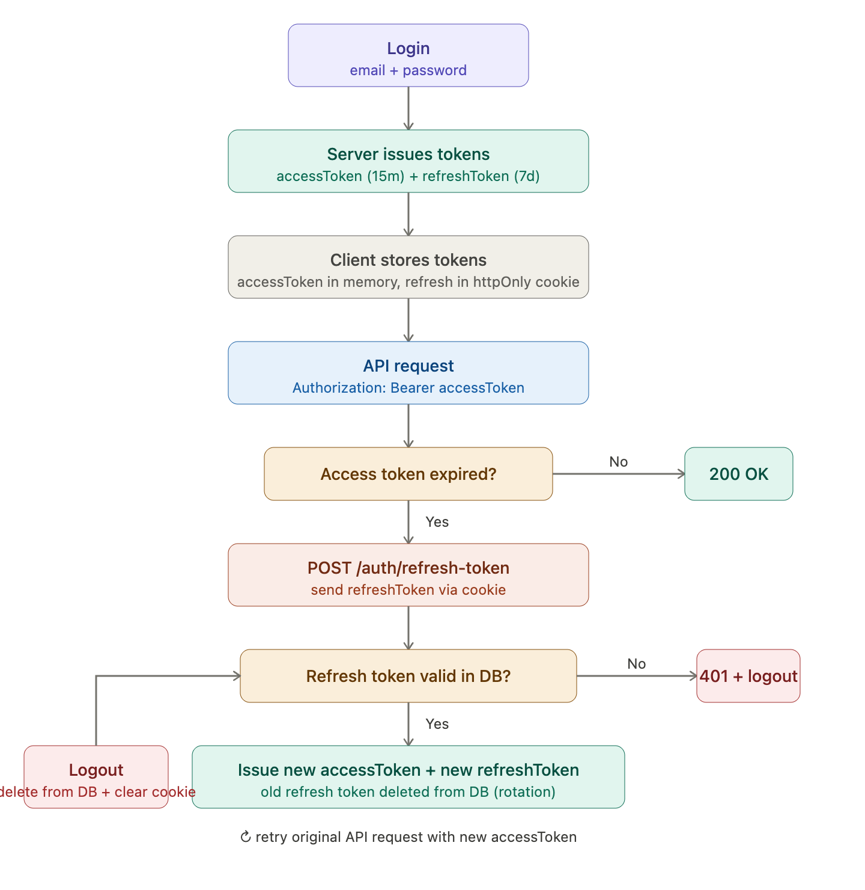

## 🚀 Day 16 — Refresh Tokens + Logout + Real Security

#### What is access token and refresh token

Ans: `Access tokens` are `short-lived` credentials used to authorize API requests, while `refresh tokens` are `long-lived` tokens used to obtain new `access tokens` without re-prompting users for credentials.

#### Why not use only one token?

Ans: We don’t use a single long-lived token because if it gets stolen, the attacker can access the system for a long time. Instead, we use a short-lived access token for API calls and a long-lived refresh token to generate new access tokens. This balances security and user experience.

#### Where to store refresh token?

Ans: Refresh tokens should ideally be stored in HttpOnly, Secure cookies to prevent XSS attacks. On the server side, they are stored in a database or cache (like Redis) for validation.

#### What happens if refresh token is stolen?

Ans: If a refresh token is stolen, an attacker can generate new access tokens repeatedly, effectively maintaining long-term access. To prevent this, we use techniques like token rotation, short expiry, and token revocation.

#### Difference between access & refresh token?

Access tokens are short-lived tokens used to access protected APIs, while refresh tokens are long-lived tokens used to generate new access tokens without requiring the user to log in again.

#### Where should access token be stored?

Access tokens should be stored in memory (in a `variable`) on the client side, `not` in localStorage or sessionStorage, to reduce the risk of `XSS` attacks.

#### Why did you NOT use JWT for refresh token?

We avoid using JWT for refresh tokens because JWTs are stateless and cannot be easily revoked once issued. If a refresh JWT is stolen, the attacker can keep generating new access tokens until it expires.
Instead, we use random refresh tokens stored in the database, which allows us to validate, revoke, and rotate them, giving us better control and security.

#### Why do we hash refresh tokens in DB?

We hash refresh tokens in the database so that even if the database is compromised, attackers cannot directly use the tokens. This is similar to password hashing — we never store sensitive tokens in plain text.